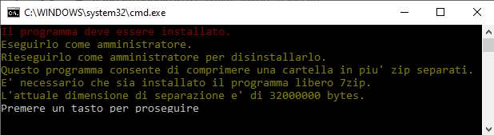

# zipdivide

This batch program zip a folder or take a zip file and divide it into many zips less than a given size.

It uses 7-zip.

Note that this is different of the split option of all the zipper I tried.

The split create many files that must be joined into one to become unzippable.

The divide process create many zip that can be all unzipped.

This utility was necessary to send big data by email that has attachment size limits.

## **Help**

Run the program without parameters.
It pauses to allow tu be run from windows.

## **Usage**

Install the program and right click on the folder to compress it.
Or run it from console giving the folder to compress or the zip to divide.
By default the max zip file size is about 32000000 bytes (+/-30MB).
The maxsize can be changed setting the user environment variable **ZIPMAXSIZEBYTES**.

It create many zip of the same name of the folder adding *"-number#total"*.
For example:

>     test-1#3.zip
>     test-2#3.zip
>     test-3#3.zip

## **Installation**

Run it as administrator. It copy itself into %ProgramFile% and set the registry to open it from the shell with a right click over folders.

## **Uninstall**

Run it as administrator again.

## **Languages**

It support english language by default but it get the region from windows registry to support others languages. Actually the second language is *Italian*.
